# 前言

自动部署的主要过程是依托于NAS，首先通过脚本将备份介质准备好，比如导出的mysql备份脚本。然后将备份介质上传到NAS中，使用NAS的自动同步功能将备份介质上传到百度云盘中。

# NAS设置

创建NAS用户ftpadmin专门用来配合脚本将备份介质上传到ftp服务器中

开通ftp服务并创建ftp文件夹

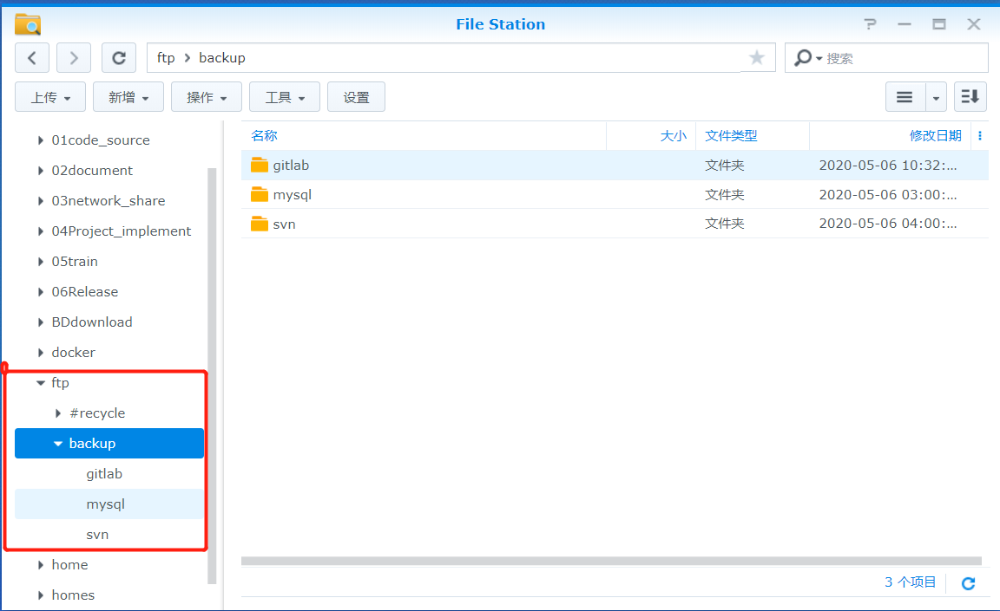

设置ftpadmin用户的共享文件夹为ftp

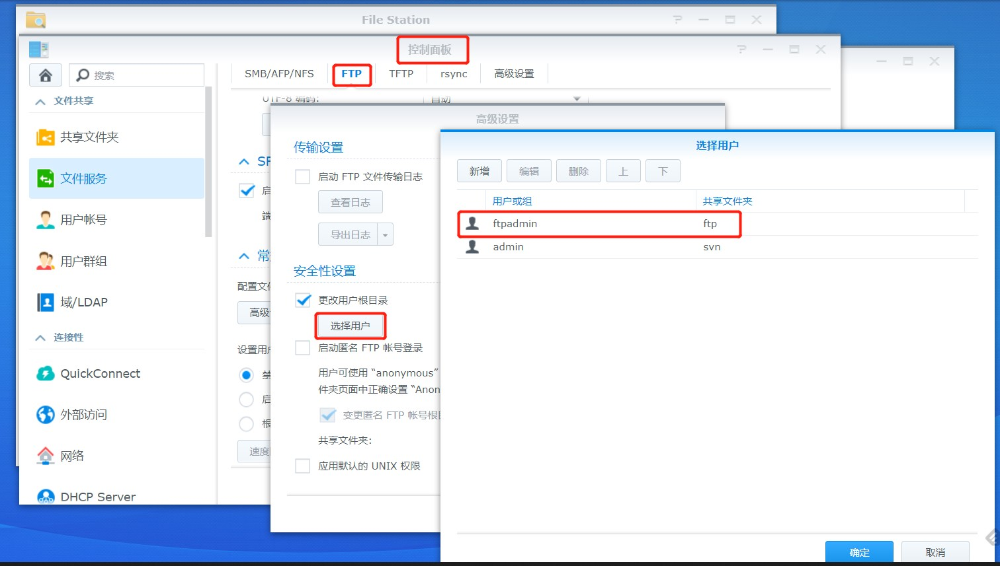

# 自动备份

## MySQL

### 备份现状

目前mysql备份只针对192.168.5.108上的mysql进行备份。

备份将会把mysql上的所有库打包，存放在NAS上的ftp/backup/mysql路径。

备份周期为每天凌晨3点进行不停服务备份，如果该时段内有长时运行脚本需要**提前报备**，否则可能会造成备份失败，或脚本执行失败。

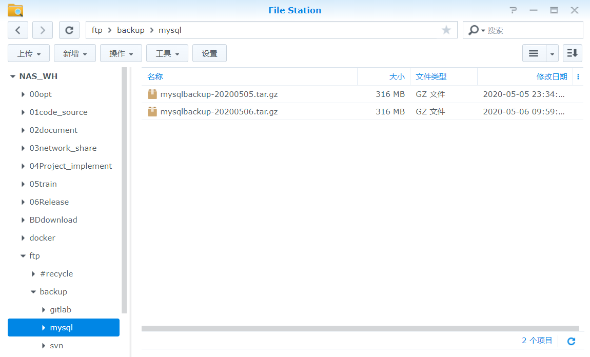

备份将会被自动同步到百度云盘中

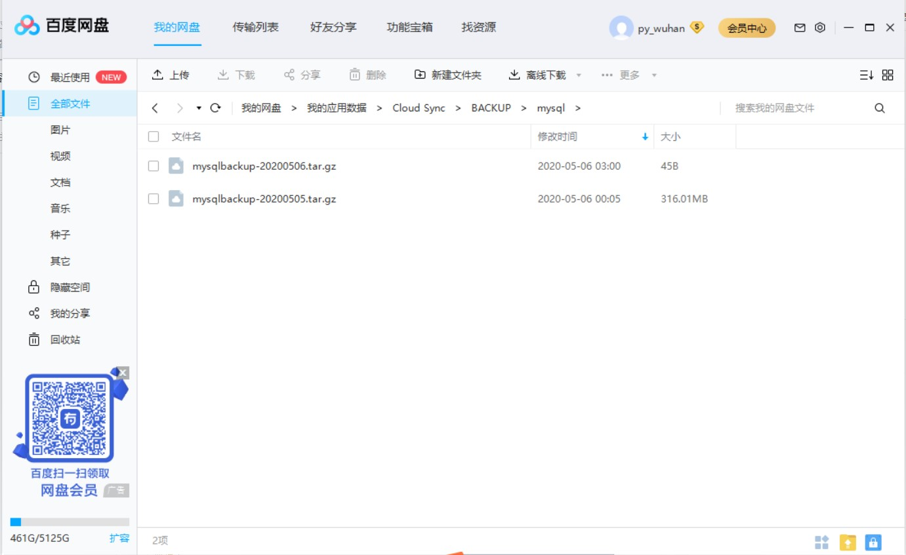

### 编写脚本

在108上创建文件夹/opt/backup/mysql

编写脚本mysqlbak.sh，该脚本的运行过程会记录在同目录下的mysqlback.log文件中

 

```
#!/bin/bash
#数据库IP
dbserver='127.0.0.1'
#数据库用户名
dbuser='data'
#数据密码
dbpasswd='data@12#$'
#数据库,如有多个库用空格分开
dbname='arturo coframe damp devops5 dgcp_test dgp dqms harbor infomation_schema jira mysql sys tjdgcp tjdgp xj_dgcp_1210'
#备份时间
backtime=`date +%Y%m%d`
#备份输出日志路径
logpath='/opt/backup/mysql/'


echo "##################start ${backtime} #############################" 
echo "开始备份" 
#日志记录头部
#echo "" >> ${logpath}/mysqlback.log
echo "------------------start backup : ${backtime}-------------------------------" >> ${logpath}/mysqlback.log
echo "备份时间为${backtime},备份数据库表 ${dbname} 开始" >> ${logpath}/mysqlback.log
#正式备份数据库
for table in $dbname; do
echo "备份${table} 开始"
source=`mysqldump -h ${dbserver} -u ${dbuser} -p${dbpasswd} ${table} > ${logpath}/${table}-${backtime}.sql` 2>> ${logpath}/mysqlback.log;
#备份成功以下操作
if [ "$?" == 0 ];then
#cd $datapath
#pwd
#为节约硬盘空间，将数据库压缩

#删除原始文件，只留压缩后文件

#删除七天前备份，也就是只保存7天内的备份
#find $datapath -name "*.tar.gz" -type f -mtime +7 -exec rm -rf {} \; > /dev/null 2>&1
echo "数据库表 ${table} 备份成功!!" >> ${logpath}/mysqlback.log
else
#备份失败则进行以下操作
echo "数据库表 ${table} 备份失败!!" >> ${logpath}/mysqlback.log
fi
done
echo "开始压缩 mysqlbackup-${backtime}.tar.gz" >> ${logpath}/mysqlback.log
#sleep 3
#ls *.sql
tar zcf mysqlbackup-${backtime}.tar.gz *.sql > /dev/null  >> ${logpath}/mysqlback.log
echo "压缩完成 mysqlbackup-${backtime}.tar.gz" >> ${logpath}/mysqlback.log

echo "上传压缩包至FTP服务器192.168.5.27"
ftp -n <<- EOF
open 192.168.5.27
user ftpadmin  1234qwer
bin
cd backup/mysql
put mysqlbackup-${backtime}.tar.gz
bye
EOF
echo "上传成功" >> ${logpath}/mysqlback.log
echo "删除所有sql文件" >> ${logpath}/mysqlback.log
rm -f *.sql
echo "完成备份"  >> ${logpath}/mysqlback.log
rm -f *.tar.gz >> ${logpath}/mysqlback.log
echo "##################end ${backtime} #############################"
echo "------------------end backup : ${backtime}-------------------------------" >> ${logpath}/mysqlback.log

```

### 添加定时任务

使用crontab将脚本加入定时任务，每天凌晨三点钟执行脚本进行备份

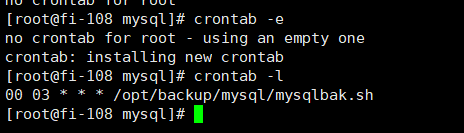

## SVN

### 备份现状

目前svn自动备份只针对192.168.5.110上的VisualSVN。

备份将会把110上所有仓库打包，存放在NAS上的ftp/backup/svn路径

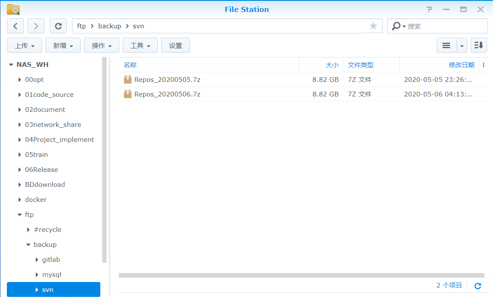

同时会将备份包自动上传到百度云盘上

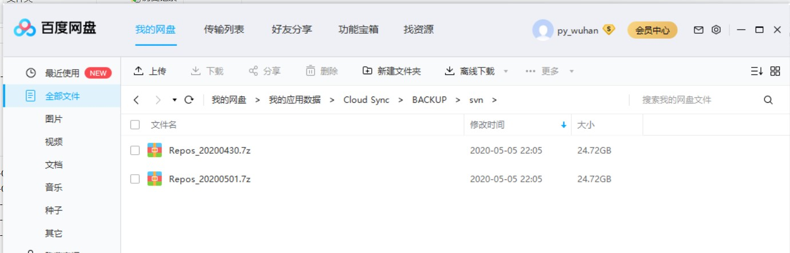

### 编写脚本

备份的SVN为192.168.5.110上的VisualSVN。需要注意的是SVN的备份仅会备份仓库的数据，并不会备份相关人员以及人员权限数据。

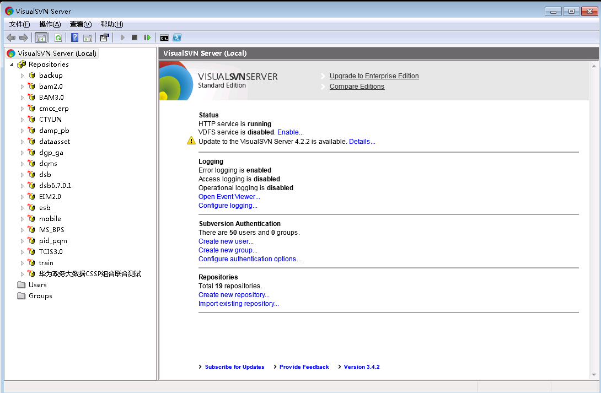

首先找到仓库所在路径：D:\primeton_pub

编写FTP上传脚本ftp.txt。

这个脚本会登录NAS上的ftp服务器，并将指定路径的压缩包上传到NAS上的指定文件夹。

 

```
open 192.168.5.27
ftpadmin
1234qwer
cd backup/svn
put e:\svnbackup\*.7z 
bye
```

编写备份脚本DumpAll.bat

该脚本过程如下：停止svn服务-->导出所有的仓库文件-->将所有的仓库文件压缩成一个压缩包-->调用ftp脚本上传压缩包-->清理本地文件

该脚本依赖一个打包程序，打包程序需要与脚本放在svn仓库的根目录下

打包程序链接：https://pan.baidu.com/s/10ky0bchT0apb9LSsja5fdQ 

提取码：v9aq

 

```
@ECHO OFF
::====================
::Author     : YunTao.Li
::Summary    : Dump 当前目录的所有 Svn 仓库，脚本将备份当前目录下的所有SVN仓库，
::Update     : 2020-05-01
::====================
net stop VisualSVNServer
sleep 5
SET VAR_DATE=%DATE:~0,4%%DATE:~5,2%%DATE:~8,2%
dir /B /AD > DIRS
IF EXIST DUMP_FILES (
  DEL /Q DUMP_FILES
)
FOR /F %%i IN (DIRS) DO (
  SET REPOS_NAME=%%i
  CALL :DUMP_REPOS
)
SET REPOS_NAME=

ECHO.
ECHO Compressing dump files...
7za a E:\svnbackup\Repos_%VAR_DATE%.7z *.bin
::md Repos_%VAR_DATE% 
::move *.bin Repos_%VAR_DATE%
ftp -s:ftp.txt

ECHO Delete dump files...
FOR /F %%i IN (DUMP_FILES) DO (
  DEL /Q %%i
)

DEL /Q E:\svnbackup\*

DEL /Q DIRS
DEL /Q DUMP_FILES

ECHO Successed.
net start VisualSVNServer
@pause
GOTO :EOF

::==== Functions ====
:DUMP_REPOS
SET DUMP_FILE=%REPOS_NAME%.bin
ECHO Dumping repository ^"%REPOS_NAME%^" ...
IF "%REPOS_NAME%" == "TCIS3.0" (
ECHO "不备份这个文件%REPOS_NAME%"
) ELSE (
svnadmin dump ^"%REPOS_NAME%^" -q > %DUMP_FILE%
)

IF %errorlevel%==0 (
  ECHO %DUMP_FILE% >> DUMP_FILES
) ELSE (
  DEL /Q %DUMP_FILE%
  ECHO Dump ^"%REPOS_NAME%^" failed.
)
SET DUMP_FILE=
ECHO.
```

### 添加计划任务

将备份脚本加入windows计划任务，保证定时运行脚本即可

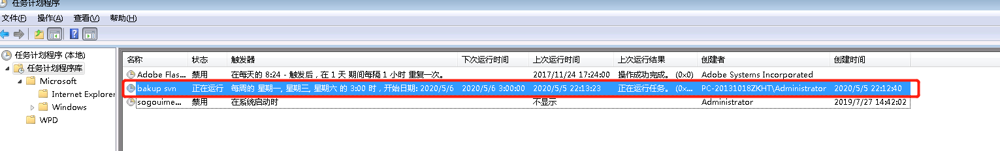

## Gitlab

### 备份现状

目前gitlab自动备份仅针对192.168.5.104上的gitlab，创建备份目录/opt/backup/gitlab

备份将会把192.168.5.104上的gitlab整体打包，上传到NAS中

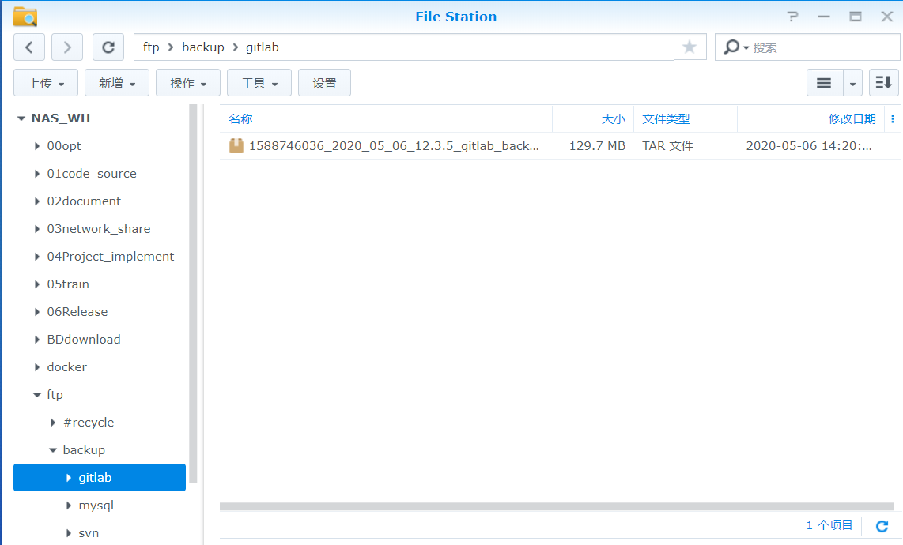

同时会将备份包自动上传到百度云盘上

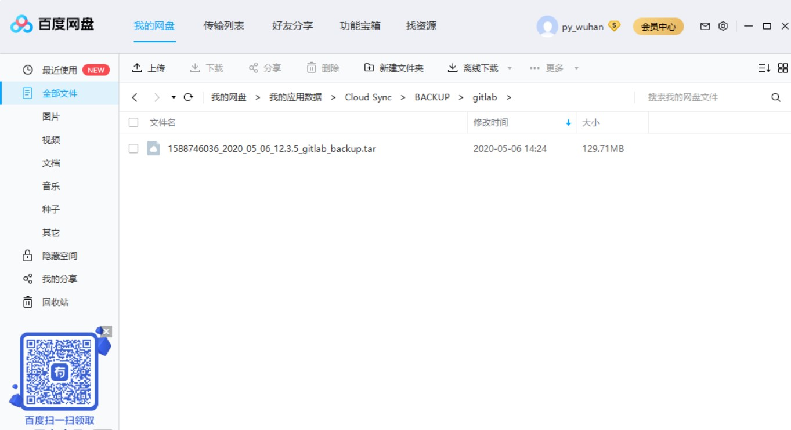

### 修改配置

 

```
#//打开 /etc/gitlab/gitlab.rb
sudo vi /etc/gitlab/gitlab.rb

#//找到
gitlab_rails['manage_backup_path'] = ture
gitlab_rails['backup_path'] = "/var/opt/gitlab/backups"

#// 两行,去掉注释符号'#',然后将 /var/opt/gitlab/backups 改成自己想要存放的备份文件路径 /opt/backup/gitlab

#找到
gitlab_rails['backup_keep_time'] = 604800
#//去掉注释符号'#',将604800改成自己想要的保存时间,这里单位是秒,604800表示一周

#// 更新gitlab配置
sudo gitlab-ctl reconfigure

#// 创建备份脚本并设置权限
touch /opt/backup/gitlab/auto-backup.sh

# // 脚本begin
gitlab-rake gitlab:backup:create
ftp -n <<- EOF
open 192.168.5.27
user ftpadmin  1234qwer
bin
cd backup/gitlab
put *.tar
bye
EOF
# // 脚本end

sudo chmod +x /opt/backup/gitlab/auto-backup.sh


```

### 添加定时任务

设置的在每天的凌晨3点进行备份

```
sudo echo "0 3 * * * /opt/backup/gitlab/auto-backup.sh" >> /etc/crontab
```